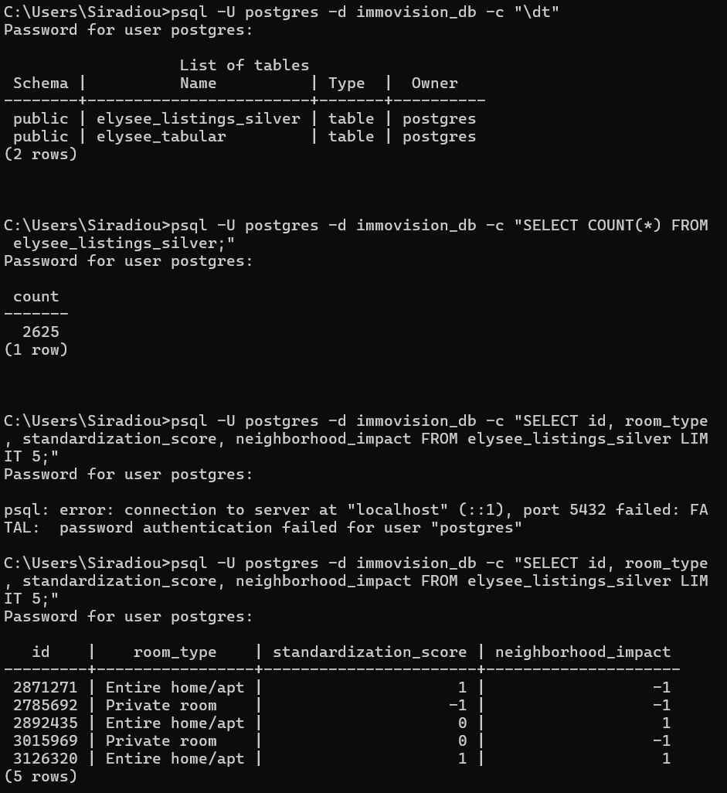

=================================================================
  RAPPORT LOAD — 06_load.py
=================================================================
  Table PostgreSQL        : elysee_listings_silver
  Base de données         : immovision_db
  Lignes attendues        : 2625
  Lignes dans PostgreSQL  : 2625
  Cohérence               : ✓ COHÉRENT
  Prix moyen (€/nuit)     : None €

  📷 Distribution standardization_score :
    Industrialisé (1) : 870
    Personnel (0) : 897
    Non analysé (-1) : 858

  📝 Distribution neighborhood_impact :
    Hôtélisé (1) : 889
    Voisinage (0) : 858
    Neutre (-1) : 878

  🏠 Top 5 hôtes multi-annonces :
    Blueground                     : 816 annonces
    Blueground                     : 816 annonces
    Blueground                     : 816 annonces
    Blueground                     : 816 annonces
    Blueground                     : 816 annonces
=================================================================
  [✓] Data Warehouse opérationnel.
  [→] Capturez ce rapport pour votre README.md (screenshot pgAdmin)
=================================================================
